  

## 📌 About Me
- 💻 Aspiring Software Developer focused on Java backend development
- 🌱 Currently learning Spring Boot and building REST APIs
- 🏗️ Interested in system design and scalable applications
- 🔐 Exploring authentication, security, and backend architecture
- 🧩 Passionate about problem-solving and Data Structures & Algorithms
- 🚀 Actively building projects to improve real-world development skills

## 🧠 My Focus Areas
- ☕ Java Backend Development
- 🌱 Spring Boot & REST API Design
- 🧩 Data Structures & Algorithms
- 🗄️ Database Design (MySQL, MongoDB)
- 🔐 Authentication & Security (JWT, RBAC)
- 🏗️ System Design Fundamentals
- ⚡ Performance Optimization & Caching (Redis)

## 📊 GitHub Stats & Trophies

  
  

  

  

  

## 🛠️ Languages & Tools

> ## Programming Languages

   

> ## Frontend

  

> ## Backend

 

> ## Database

  

> ## Tools

   

  

 

## 🔗 Connect with Me

 

<picture>
  <source media="(prefers-color-scheme: dark)" srcset="https://raw.githubusercontent.com/abozanona/abozanona/output/pacman-contribution-graph-dark.svg">
  <source media="(prefers-color-scheme: light)" srcset="https://raw.githubusercontent.com/abozanona/abozanona/output/pacman-contribution-graph.svg">
  
</picture>

  

